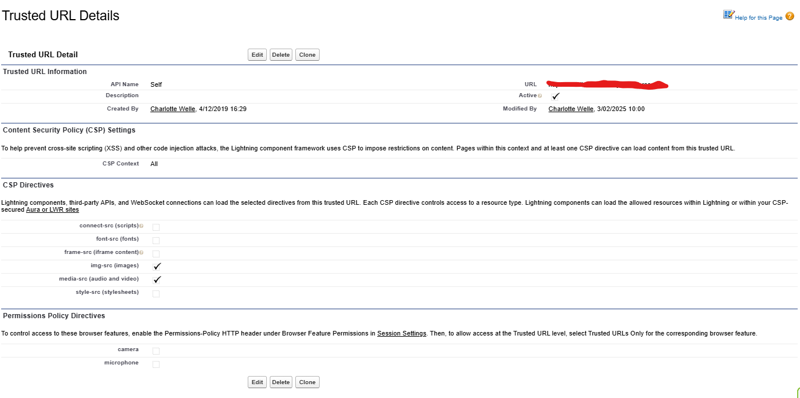

# Audio Player

Provide an audio player.

## Features:

- Provide an audio player with public method "pause" and "play".

## Setup

### Add Org as a trusted url.

In the "URL" set value first to your organisation url.

## Parameters

- Mandatory

  - audioContentDocumentId Id of the audio content document

- Optional

  - showDetails true if you want to display the title and file type; false if you don't want to display them. Default is false.
