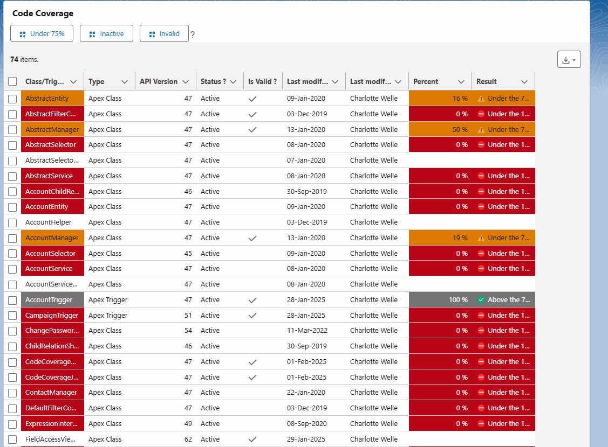
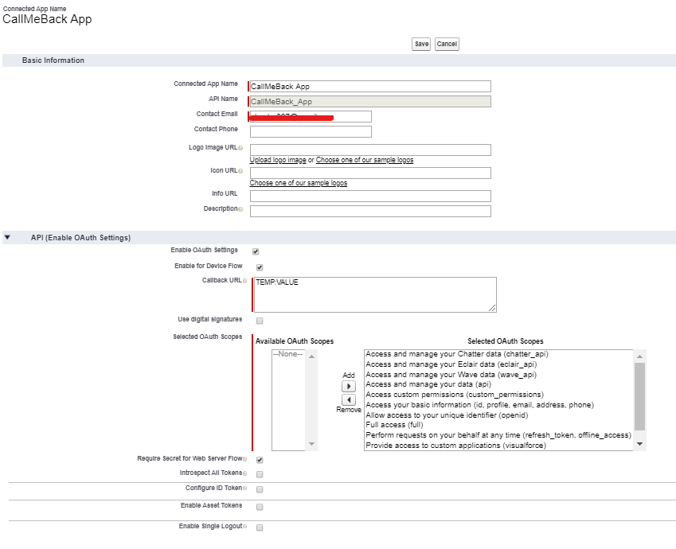
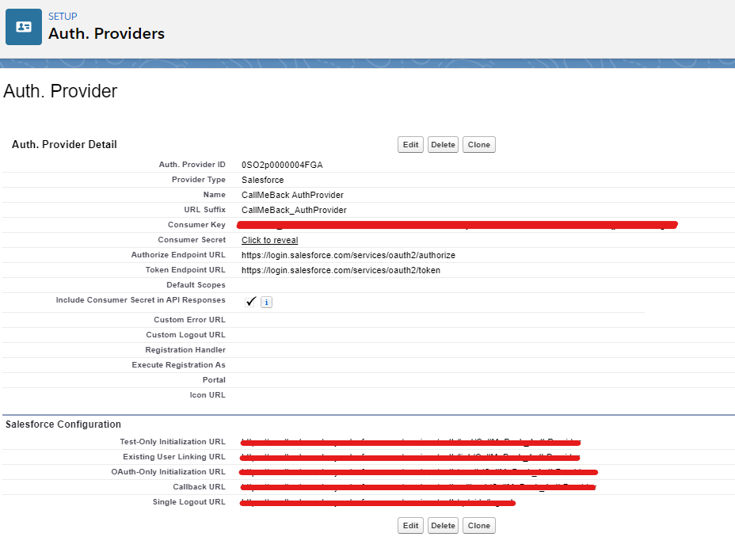
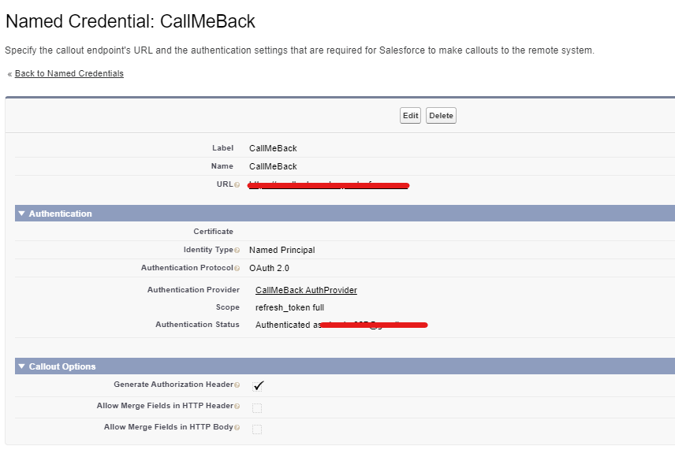

# Code Coverage

Provide code coverage information.
After running tests, you can view code coverage information in the Tests tab of the Developer Console. The code coverage pane includes coverage information for each Apex class and the overall coverage for all Apex code in your organization.

With this component you can have another view of the code coverage.

## What's new ?

- 01/02/2025:

  - Added users filter.
  - Added loading spinner.

## Features:

- View code coverage by Apex class or trigger.
- Filter results by:
  - Coverage percent
  - Validity (Indicates whether any dependent metadata has changed since the class was last compiled (true) or not (false).)
  - Status (active or not).
- Download data as XLS file.
- Can be used in Homepage, AppPage and RecordPage.

## Setup

### Create a connected app.

In the "Callback URL" set value first to "TEMP:VALUE", we'll change this value after.

### Create an auth provider.

Copy the "Callback URL" ("Salesforce Configuration" section") in the "Callback URL" of the connected app.

### Create a named credential.

Fill the Consumer Key and the Consumer Secret with the values given in the Auth provider.

## What if ?

You can change the name of the Named Credential but then you have to change it in the **CodeCoverageController** class.
