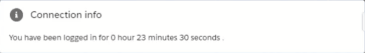

# Lightning Web Component: Connection info.

Provide user connection information.
Can be added in:

- Lightning app page.
- Lightning record page.
- Lightning homepage.
- Lightning utility bar in an app page.

## Parameters

* Optional
    - title Specify the title card. Default is "Connection information".

