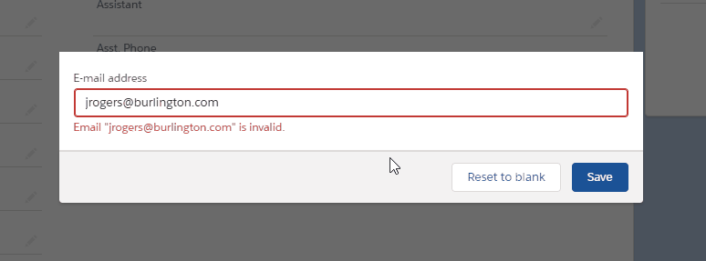
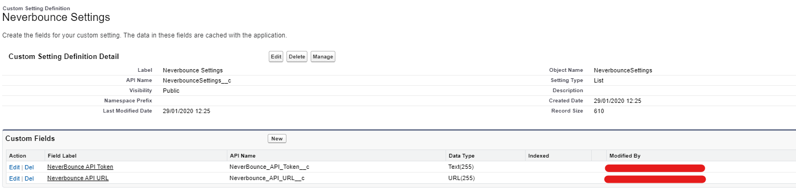
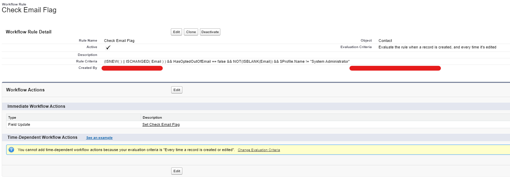

# Contact Email Verification

## Setup

### Add neverbounce as remote site.

### Create custom settings:

### Adapt workflow rule

## Usage

Put this lightning component in the contact record page.
When loading the contact, the component will check if the flag "Check_Email__c" is set to true.
If that is the case, it will send a callout to "neverbounce" to check the validity of the email.
