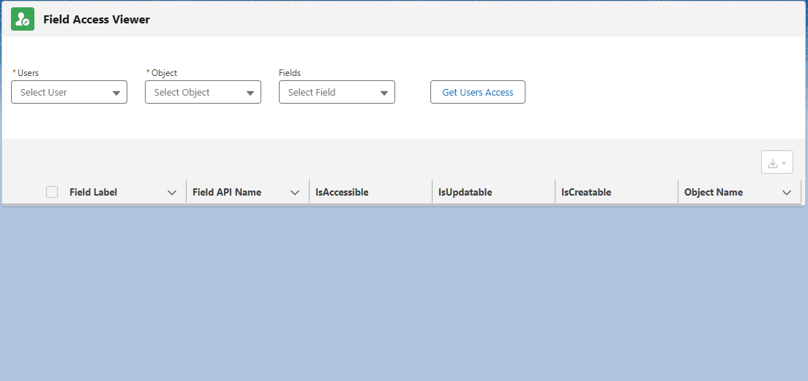

# Lightning Web Component: Field Access Viewer

## What's new ?

- 31/01/2025:

  - Add column "Type" (Datatype of the field).

## Features:

- View field(s) accesses by object and user.
- Download list of records as CSV file.
- Can be used in Homepage, AppPage and RecordPage. If used on RecordPage, the "Object" combobox will be disabled and set on the current record object.

## Parameters

### Record page

- Mandatory

  - recordId current record id (provided by default in a lightning record page).

- Optional

  - showDetails Specifies if the sub-header that show total, sort and filter(s) is displayed.
  - allowDownload Specifies if the user can download the table as a CSV file.

### Home page and app page

- Optional

  - showDetails Specifies if the sub-header that show total, sort and filter(s) is displayed.
  - allowDownload Specifies if the user can download the table as a CSV file.
