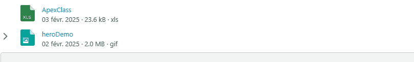

# Lightning Web Component: File Attachment

Mimic the Salesforce file view extended as an accordion section if it is not empty.
The section can contain HTML markup or Lightning components.



## Features:

- Mimic the Salesforce file view.
- Click on file will open the Salesforce file preview.
- Click on the accordion will show/hide the content section and send an event "sectionopen" or "sectionclose".

## Parameters

- Mandatory

  - contentDocumentId Content Document Id.

- Optional

  - slot content section. Can be empty.

## Usage

```
<c-file-attachment content-document-id="069KA000003sc4QYAQ"></c-file-attachment>

<c-file-attachment content-document-id="069KA000003sZbtYAE">
    This is the content.
</c-file-attachment>
```
