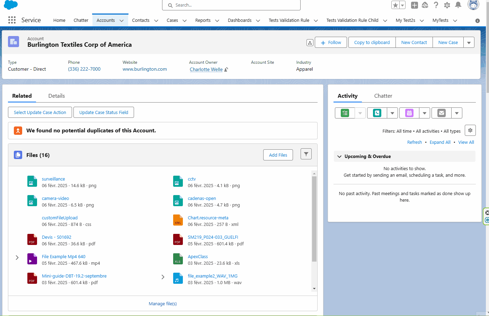

# Lightning Web Component: File Attachments

Mimic the Salesforce files view with some features.

## Features:

- Mimic the Salesforce file view.
- Click on file will open the Salesforce file preview.
- Click on the accordion will show/hide the content section.

## Parameters

- Mandatory

  - recordId (Provided by the lightning record page).

- Optional

  - allowMultipleSectionsOpen If present, the accordion allows multiple open sections. Otherwise, opening a section closes another that's currently open. Default is false;

## Dependencies

- "File Attachment" component [Readme](<./../File Attachment/readme.md>).
- "Video Player" component [Readme](<./../Video Player/readme.md>).
- "Audio Player" component [Readme](<./../Audio Player/readme.md>).
- "Button Custom Filter" component [Readme](<./../Button Custom Filter/readme.md>).
  - "File Upload Custom" component [Readme](<./File Upload Custom/readme.md>).
