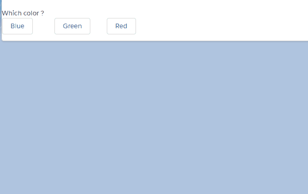

# Lightning Web Component: Connection info.

Provide generic flowchart customizable with a JSON.
When a choice is done (reaching a node with "answer") an event "chosen" is dispatch (bubble: true, composed: true) where result is stored in ```event.detail.choice```.

## Parameters

* Mandatory
    - json Specify the structure of the flowchart.
    IE:
    ```json
        {
          "question": "Which color ?",
          "choices": [
            {
              "name": "Blue",
              "value": {
                "question": "Really ?",
                "choices": [
                  {
                    "name": "yes",
                    "value": {
                      "answer": "It is blue!!"
                    }
                  },
                  {
                    "name": "no",
                    "value": {
                      "answer": "Open your eyes!"
                    }
                  }
                ]
              }
            },
            {
              "name": "Green",
              "value": {
                "question": "Really ?",
                "choices": [
                  {
                    "name": "Yes",
                    "value": {
                      "answer": "It is green!!"
                    }
                  },
                  {
                    "name": "No",
                    "value": {
                      "answer": "hu?!"
                    }
                  }
                ]
              }
            },
            {
              "name": "Red",
              "value": {
                "question": "Is it red ?",
                "choices": [
                  {
                    "name": "Yes",
                    "value": {
                      "answer": "It is red!!"
                    }
                  },
                  {
                    "name": "No",
                    "value": {
                      "question": "Is it green ?",
                      "choices": [
                        {
                          "name": "Yes",
                          "value": {
                            "answer": "It is green!!"
                          }
                        },
                        {
                          "name": "No",
                          "value": {
                            "answer": "Choose yourself!"
                          }
                        }
                      ]
                    }
                  }
                ]
              }
            }
          ]
        }```



