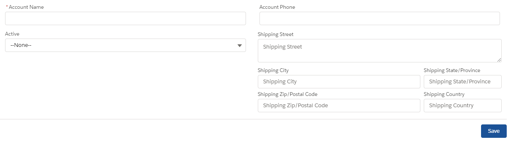

# Lightning Web Component: Generic Create Record

This component provide a generic lightning-edit-record with:
 - Field(s) to be displayed.
 - Predefined values.
Similar to the native Salesforce functionality.

## Parameters

* Mandatory
    - objectApiName Specify the object API name of the record to be created.
    -  fields Specify the editable field(s) to be displayed. Format: array of string (each string is the api name of the fields. If a field is not found then a blank will be inserted).
     IE: [
          "Aim__c",
          "Plant__c",
          "",
          "Due_Date__c",
         ];

    - predefinedValues Specify the predefined values. Those fields and related values are hidden and used only during the creation of the record. Format: JSON.
     IE: {
              Opportunity__c: xxxxxxxxx,
              Type__c: yyy,
         }

    - mandatoryFields Specify the mandatory fields. (Can be empty) Format: array of string (each string is the api name of the fields.
     IE: [
          "Aim__c",
          "Due_Date__c",
     ];

     - recordTypeId Specify the record type Id of the record to be created.

* Optional
    - redirectToNewRecord indicates if the user should be redirect to the newly created record after its creation.

All fields are case-sensitive.

