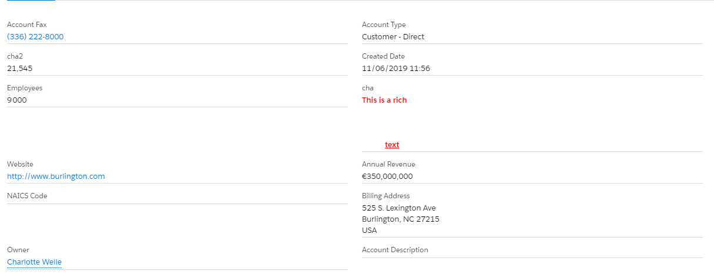

# Lightning Web Component: Generic Custom Layout

This component provide a configuration to display record field in read-only mode, similar to the native Salesforce functionality.

## Features

- Read-only.

## Parameters

- Mandatory
  - recordId Id of the record.
  - objectApiName SObject name.
  - fields Specifies a list of one or more fields, separated by commas, that you want to retrieve from the specified object. If the field mentioned does not exist, a blank is inserted.
  - numberOfColumns Specifies the number of columns in the layout.
- Optional
  - useLinkWithPopOver define if the custom LWC "Link with pop over" should be use when a field is a reference.

###### Notes

The API "fields" parameter can not contains:

- Any field child-to-parent. IE: LastModifiedBy.Name
- If you want to display a reference, you must use field Id: LastModifiedById will display LastModifiedBy with the URL LastModifiedById.
