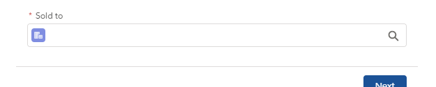

# Lightning Web Component: Generic Lookup

## Parameters

* Mandatory
    - label Specify the label to display.
    - recordId Specify the record Id if preselection is done.
    - objectApiName Specify the Object API Name.
    - fields Specify the fields to retrieve and that will be returned in event detail. Should contain at least Id and Name (for the display).
    if the real object (lookup, to be mention in lookupObjectAPiName) is different (ie: AccountContactRelation as objectApiName and Contact as lookupObjectApiName), fields should be the fields of the lookup.
    - isBubbleEvent Specify if the event should be bubble up. Will trigger the onchange.
    event.detail.value will contain the selected record.
    - eventName Specify the event name to dispatch when the value has changed. Mandatory if isPubSubEvent is set to true.
    - isPubSubEvent Specify if the event should be fire with pubsub.
    data will contain the selected record.
 
* Optional
    - displayFields fields to display in the selection (if multiple, will be separated by a -)
    - required false by default.
    - disabled false by default.
    - fieldLevelHelp Help text detailing the purpose and function of the lookup.
    - iconName if not specified, the component will query the record details on initialization.
    - where Specify the "Where" condition.
    - idField Specify which field of the result is the Id.
    - nameField Specify which field of the result is the Name to display.
    - isCombobox use a combobox (picklist) instead of autocomplete and load all elements.
    - lookupObjectApiName the real object. Useful when you make "join" query (ie: you want Contact from AccountContactRelation), when the record is reloaded, you have to specify the "real" object.

###### Notes

Please be aware that if the `iconName` is not set then the component will query the record details on initialization. 
Take it in consideration when using it in an iteration.
