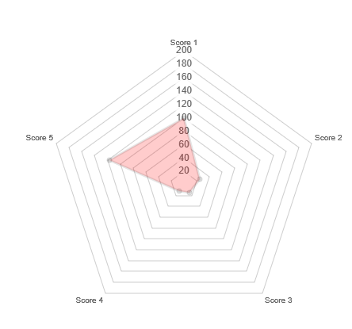

# Lightning Web Component: Generic Chart.

## Parameters

* Mandatory
    - recordId current record id (provided by default in a lightning record page).
    - objectApiName current object API name (provided by default in a lightning record page).
    - fields Specifies the fields to retrieve data to be displayed, separated by a semicolon.

* Optional
    - title Specify the title to display.
    - showTitle Specify if the title should be display.
    - width Specify the chart width.
    - height Specify the chart height.
    - min Specify minimum number for the scale.
    - max Specify maximum number for the scale.
    - step Specify step size for the scale.
    - align Specify the horizontal alignment (left, center, right).
    - backgroundColor Specify the RGBA value of the background (ie: 255,0,255,0.2)
    
## Todo

Support only spider chart for the moment, other charts should be added.