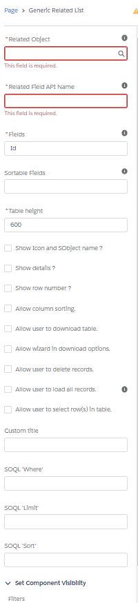

# Lightning Web Component: Generic Related List Table

Generic lightning:datatable using field sets &amp; lightning app builder design parameters to define what fields to show.

<aside class="warning">
UNDER CONSTRUCTION
</aside>

## Features:
- Child-to-parent SOQL query supported (ie: fields=Contact.Name, Id, Name).
- Read-only.
- Provide fields to set SOQL query.
- Lazy loading.
- Download table as CSV file.
- Custom types support for:
    - Record url.
    - Combobox.
    - Image (if given field is Type of URL and its fieldname contains 'photo', 'image' or 'picture').

## Parameters

* Mandatory
    - selectedObject Specifies the type of object that you want to query().
    - fields Specifies a list of one or more fields, separated by commas, that you want to retrieve from the specified object.
    - tableHeight Specifies the height (in px) of the table. Default is 600px.
    - relationshipFieldAPIName relationship field between record and related list records.

* Optional
    - sortableFields API names of field(s) sortable, separated by a comma. 
    - soqlWhereParam If WHERE is specified, determines which rows and values in the specified object (objectType) to filter against. If unspecified, the query() retrieves all the rows in the object that are visible to the user.
    - soqlLimitParam Specifies the number of rows to return.
    - soqlSortParam Specifies a list of one or more fields, separated by commas, that are used to order the query results.
    - showHeader Specifies if the header (title and column) are displayed.
    - showDetails Specifies if the sub-header that show total, sort and filter(s) is displayed.
    - subTotals Specifies the list of fields (separated with a comma) in order to have total record for each field.
    - showRowNumber Specifies if the row number is displayed.
    - allowDownload Specifies if the user can download the table as a CSV file.
    - allowDeleteRecord Specifies if the user can delete record(s).
    - allowLoadAllData If checked, a 'Load All' button will be available, allowing user to load all data by clicking it.
    - allowWizardDownload Specifies if the user can have access to the wizard in download
    - allowColumnSort Specifies if column sorting is allowed.
    - customTitle Specifies a custom text for the title. If not set, will display the SObject name.
    
