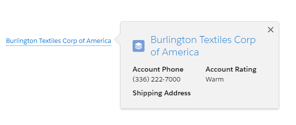

# Lightning Web Component: Link with popover

This component creates link to a record, displaying a compact view of the record when the mouse overs the link, similar to the native Salesforce functionality.

## Parameters

* Mandatory
    - recordId Id of the record. 
    - fields Specifies a list of one or more fields, separated by commas, that you want to retrieve from the specified object.

* Optional
    - recordName name to display. 

###### Notes

Please be aware that if the `recordName` is not set then the component will query the record details on initialization. If set, the details will be loaded when mouse hover the link.
Take it in consideration when using it in an iteration.

###### Example with record id of an account and fields set to " Name, Phone,  Rating  ,ShippingAddress".

