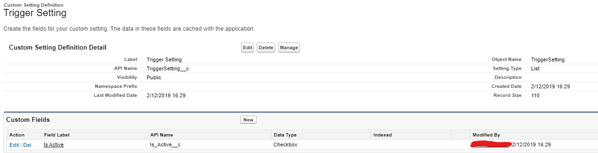

# Framework

The purpose of this framework is to manage APEX triggers and SOQL queries.

## Triggers
### Usage

To create a trigger handler, you simply need to create a class that inherits from **AbstractTriggerHandler.cls**. Here is an example for creating an Opportunity trigger handler.

```java
public class OpportunityTriggerHandler extends AbstractTriggerHandler {
```

In your trigger handler, to add logic to any of the trigger contexts, you only need to override them in your trigger handler. Here is how we would add logic to a `beforeUpdate` trigger.

```java
public class OpportunityTriggerHandler extends AbstractTriggerHandler {
  
  override
  public void beforeInsert(List<SObject> newSObjects) {
    for(Opportunity o : (List<Opportunity>) newSObjects) {
      // do something
    }  
  }

  // add overrides for other contexts

}
```
To use the trigger handler, you only need to call the **TriggerDispatcher.cls** within the trigger handler itself and call the `run()` method. Here is an example of the Opportunity trigger.

```java
trigger OpportunityTrigger on Opportunity (before insert, before update) {
  OpportunityTriggerHandler handler = new OpportunityTriggerHandler();
  TriggerDispatcher.run(handler);
}
```

### Features

#### Max Loop Count

To prevent recursion, you can set a max loop count for Trigger Handler. If this max is exceeded, and exception will be thrown. A great use case is when you want to ensure that your trigger runs once and only once within a single execution. Example:

```java
public class OpportunityTriggerHandler extends AbstractTriggerHandler {

  public OpportunityTriggerHandler() {
    this.setMaxLoopCount(1);
  }
  
  override
  public void beforeInsert(List<SObject> newSObjects) {
  for(Opportunity o : (List<Opportunity>) newSObjects) {
    // do something
  }

}
```

#### Block recursion

You can also block recursive call this way:

```java
override
public void beforeInsert(List<SObject> newSObjects) {
    if (hasNotRan('before insert')) {
        TriggerDispatcherTest.LAST_METHOD_CALLED = 'beforeInsertNoRecursionTestHandler';
        setHasRan('before insert');
    }
}
```

> :warning: BE AWARE OF:
> - A transaction that does DML on more than 200 records (e.g. execute anonymous, VF controller, REST service, …)
>   One don’t want the execution of records 201-… to be halted because of a recursion Boolean set during records 1-200.
> 
> - A transaction that uses Database.insert(someList,false) where the allOrNothing argument allows partial successes.
>   Per the SFDC APEX doc, if any errors occur, the triggers will be re-executed a second and possibly a third time on the records that succeeded on pass 1.
>   Again, one don’t want the trigger recursion Boolean to prevent execution of the handler on pass 2 (3) just because on pass 1 the recursion Boolean was enabled.


#### Disable specific trigger(s)

With the custom setting "Trigger Setting", you can enable or disable a specific trigger:

**Custom Settings:** (Trigger Setting)



**Trigger Setting Data:** (Create record for each trigger, optional)


> :warning: If the setting do not exist, it will be enable by default.

#### Bypass API

What if you want to tell other trigger handlers to halt execution? That's easy with the bypass api:

```java
public class OpportunityTriggerHandler extends AbstractTriggerHandler {
  
  public override void afterUpdate() {
    List<Opportunity> opps = [SELECT Id, AccountId FROM Opportunity WHERE Id IN :Trigger.newMap.keySet()];
    
    Account acc = [SELECT Id, Name FROM Account WHERE Id = :opps.get(0).AccountId];

    TriggerDispatcher.bypass('AccountTriggerHandler');

    acc.Name = 'No Trigger';
    update acc; // won't invoke the AccountTriggerHandler

    TriggerDispatcher.removeBypass('AccountTriggerHandler');

    acc.Name = 'With Trigger';
    update acc; // will invoke the AccountTriggerHandler

  }

}
```

If you need to check if a handler is bypassed, use the `isBypassed` method:

```java
if (TriggerDispatcher.isBypassed('AccountTriggerHandler')) {
  // ... do something if the Account trigger handler is bypassed!
}
```

If you want to clear all bypasses for the transaction, simple use the `clearAllBypasses` method, as in:

```java
// ... done with bypasses!

TriggerDispatcher.clearAllBypasses();

// ... now handlers won't be ignored!
```

## SOQL Query
### Usage

### Features
