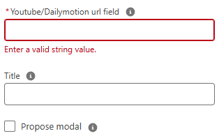
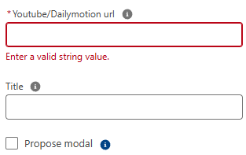

# Lightning Web Component: Video Player

## Features:

Youtube and Dailymotion video player.
Can be used either on record page, homepage and app page.

## Parameters

### Record page

- Mandatory

  - recordId current record id (provided by default in a lightning record page).
  - fieldApiName Field API name containing the Youtube or Dailymotion video URL (including video ID)

- Optional

  - title title to display above the video.
  - allowModal Allow user to show video in modal ? (default is false)

### Home page and app page

- Mandatory

  - videoUrl Full URL of the Youtube or Dailymotion video (including video ID).

- Optional

  - title title to display above the video.
  - allowModal Allow user to show video in modal ? (default is false)

## TODO

- Add Vimeo support.
