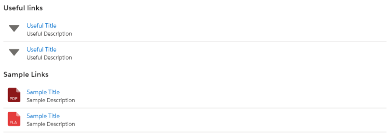
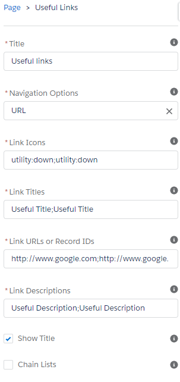

# Lightning Web Component: Useful Links.

- Lightning app page.
- Lightning record page.
- Lightning homepage.

Configurable Lightning web component allowing to display useful links for users.

## Features

## Parameters

* Mandatory
    - navigationOptions Used to control whether your links are to hosted Salesforce Content, generic URLs or SObject records.
    - linkIcons The Lightning Design System name of the icon. Names are written in the format 'utility:down' where 'utility' is the category, and 'down' is the specific icon to be displayed. Icons can be found here - https://lightningdesignsystem.com/icons/
    - linkTitles The title you want displayed. For multiple links separate the titles with a semicolon. I.E. Title 1;Title 2
    - linkUrlsOrIds Used to hold either the URLs or Record IDs.
    - linkDescriptions The description you want displayed. For multiple links separate the descriptions with a semicolon. I.E. Description 1;Description 2

* Optional
    - title Specify the title card. Default is "Useful links".
    - showTitle Specify the title card. Default is "Useful links".
    - chainLists If you are looking to combine lists of URLs and Salesforce content, enable this to chain the list.

## Usage

##### Notes and considerations

* It is essential that Link Icons, Link Titles, Link URLs or Record IDs and Link Descriptions are all the same length.
* If you are not wanting to add descriptions for your links as an example just leave blank spaces. I.E. ; ;
