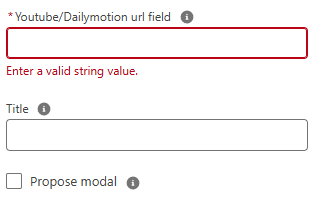
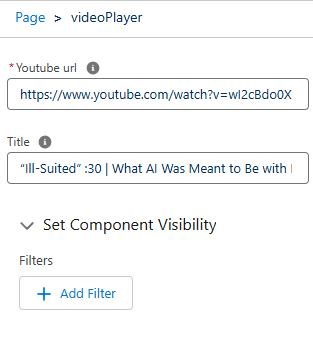

# Lightning Web Component: Video Player

## Features:

Can be used either on record page, homepage and app page.

## Parameters

### Record page

- Mandatory

  - recordId current record id (provided by default in a lightning record page).
  - fieldApiName Field API name containing the video URL.

- Optional

  - title title to display above the video.

### Home page and app page

- Mandatory

  - videoUrl Full URL of the video (including video ID).

- Optional

  - title title to display above the video.
