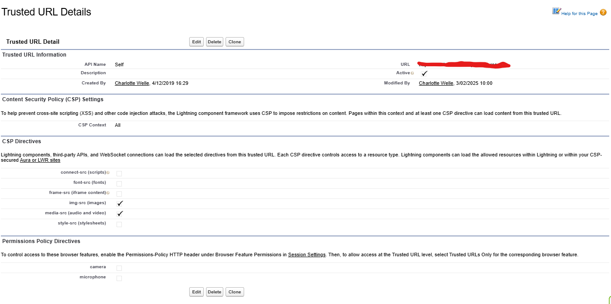

# Video Player

Provide an video player.

## Features:

- Provide an video player.

## Setup

### Add Org as a trusted url.

In the "URL" set value first to your organisation url.

## Parameters

- Mandatory

  - videoContentDocumentId Id of the video content document

- Optional

  - showDetails true if you want to display the title and file type; false if you don't want to display them. Default is false.
