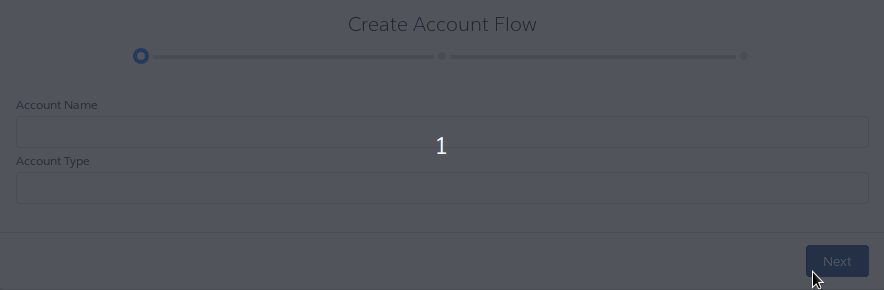

# Wizard

This components aims to provide a way to programmatically build flows with Salesforce Flow styles and functionality, having full control of the wizard behavior in any scenario.



## Features

    - Define wizard with Lightning Web components declaratively.
    - Define component step container to be used in c-generic-wizard-step.
        see GenericWizardStepContainer as an example.
        * setActive is called when the step become active.           
        * setInactive is called when the step become inactive.
            With active/inactive you can prevent re-rendering of the step screen if it is inactive.           
        * validate is called on before-change event.           
    - Override standard Navigation buttons defining specific step actions.
    - Customize flow using JavaScript function for step validation and post-processing.
    - Modify the flow steps using standard LWC templates.

## Usage

````xml
<template>
    <c-generic-wizard header="My Account Wizard" variant="base" current-step="step-1" oncomplete={completeWizard}>
        <c-generic-wizard-step label="Enter Account" name="step-1">
            <lightning-input label="Account Name"></lightning-input>
            <lightning-input label="Account Type"></lightning-input>
        </c-generic-wizard-step>
        <c-generic-wizard-step label="add Contact" name="step-2" before-change={validate} hide-next-button={hideNextButton}>
            <lightning-input label="Name"></lightning-input>
            <lightning-input label="Title"></lightning-input>

            <lightning-button slot="actions" label="Skip" onclick={skipCreateContact}></lightning-button>
        </c-generic-wizard-step>
        <c-generic-wizard-step label="add case" name="step-3" before-change={validate}>
            <c-generic-wizard-step-container></c-generic-wizard-step-container>
        </c-generic-wizard-step>
        <template if:true={shouldSync}>
            <c-generic-wizard-step label="Sync with another system" name="step-3">
            </c-generic-wizard-step>
        </template>
    </c-generic-wizard>
</template>

@track hideNextButton = true;

skipCreateContact() {
    this.template.querySelector('c-generic-wizard').moveNext();
}

completeWizard() {
    // finish.
}

validate() {
    // do some validation.
}

shouldSync() {
    // sync!
}
````

## Specification

### c-wizard

#### Attributes

|       Name      |  Type  | Access | Required |  Default | Description                                                                                 |
|:---------------:|:------:|:------:|:--------:|:--------:|---------------------------------------------------------------------------------------------|
|      variant    | string | global |          |   base   | Wizard style. Valid values are base, base-shaded and path.                                  |
|  previous-label | string | global |          | Previous | Previous button label.                                                                      |
| next-label      | string | global |          | Next     | Next button label.                                                                          |
| finish-label    | string | global |          | Finish   | Finish button label.                                                                        |
|      header     | string | global |          |          | Header text shown on wizard. Leave blank for not displaying header.                         |
|  current-step   | string | global |          |          | Sets the current step of the wizard. Defaults to first c-wizard-step on the markup if null. |

#### Slots

|       Name      |  Description    |                                             
|:---------------:|:---------------:|
|      header     | Placeholder for wizard header. Overrides the header attribute set on the component.|
|      default     | Placeholder for c-wizard-step. Defines the wizard flow.|

#### Custom Events

##### change

The event fired when the wizard advances or goes back following the configured step flow. An external change by setting the attribute current-step does not emit this event.
 
The change event returns the following parameters.

|Parameter      |  Type  | Description |
|:------:|:--------:|:--------:|
| currentStep | string | The step name the wizard is moving to.|
| oldStep | string  | The step name the wizard is moving from|

The change event properties are as follows.

|Property      |  Value  | Description|
|:------:|:--------:|:--------:|
|bubbles|false|This event does not bubble up through the DOM.|
|cancelable|false|This event has no default behavior that can be canceled. You can't call preventDefault() on this event.|
|composed|false|This event does not propagate outside of the component in which it was dispatched.|

##### complete

The event fired when the wizard finishes and the user clicks on Finish button.

The complete event properties are as follows.

|Property      |  Value  | Description |
|:------:|:--------:|:--------:|
|bubbles|false|This event does not bubble up through the DOM.|
|cancelable|false|This event has no default behavior that can be canceled. You can't call preventDefault() on this event.|
|composed|false|This event does not propagate outside of the component in which it was dispatched.|

### c-wizard-step

#### Attributes

|       Name      |  Type  | Access | Required |  Default | Description                                                                                 |
|:---------------:|:------:|:------:|:--------:|:--------:|---------------------------------------------------------------------------------------------|
|      name    | string | global |   true       |      | Step unique name. Identifies the step.                                  |
|  label | string | global |    true      |  | Step label shown on wizard progress.                                                                     |
| hide-previous-button     | Boolean | global |          | false     |Hides the Previous button on this step.                                                           |
| hide-next-button     | string | global |          | false   | Hides the Next/Finish button on this step.                                                                        |
| before-change     | function | global |          |    | Custom function to execute to perform post-processing action before advancing to the next step. It should return a promise with a true/false; if resolved with a falsy value, the wizard will mark the step as error and will not advance to the next step.

#### Slots

|       Name      |  Description    |                                             
|:---------------:|:---------------:|
|      actions     | Placeholder for actionable components on the step such as lightning-button. The components are positiones next to Next button. Overrides the header attribute set on the component.|
|      default     | Placeholder for step content.|